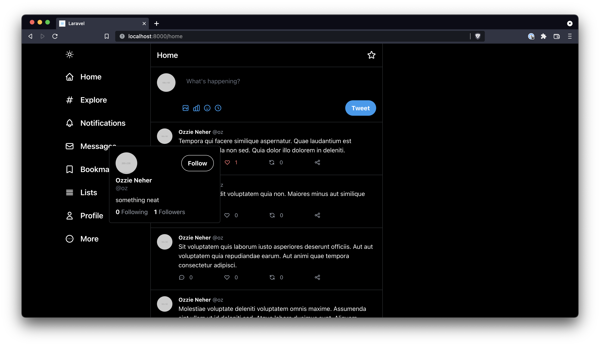
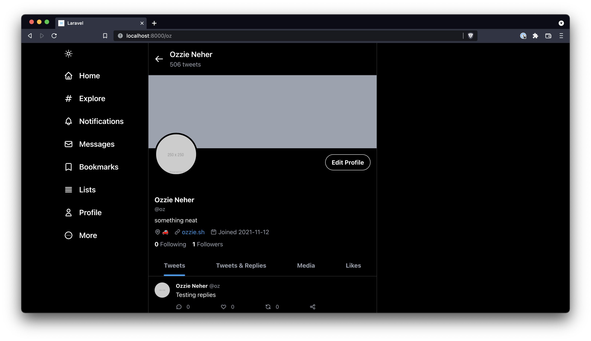
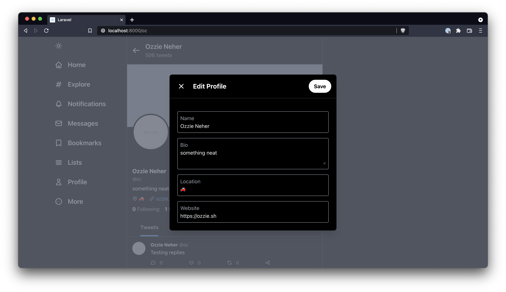

# Twitter, but in Laravel

Why? Idk I'm bored and wanted to try out a few new concepts.

Going for a 1:1 recreation of Twitter in Laravel.

## Screenshots

## Roadmap

- [x] ~~Basic home feed~~
- [x] ~~Basic tweet pagination~~
- [x] ~~Post a tweet~~
- [x] ~~Like a tweet~~
- [x] ~~Reply to a tweet~~
- [x] ~~Follow a user~~
- [x] ~~Unfollow a user~~
- [x] ~~Edit your profile~~
- [x] ~~View a users tweets~~
- [x] ~~View a users likes~~
- [x] ~~View a users followers~~
- [x] ~~View who a user is following~~
- [x] ~~Hover avatar for a profile quicklook~~
- [x] ~~Upload an avatar~~
- [x] ~~Upload a cover image~~
- [ ] Light / dark mode
- [ ] Retweets
- [ ] Quote retweet
- [ ] Share dialog
- [ ] DM a user
- [ ] Send a tweet via dm
- [ ] Hashtags
- [ ] User mentions
- [ ] PHPStan level 9 (?)
- [ ] PEST tests

## Running

* Configure db creds in `.env`
* `$ composer install`
* `$ php artisan migrate`
* `$ npm i`
* `$ npm run dev`
* `$ php artisan serve`
* Visit `http://localhost:8000/login`
